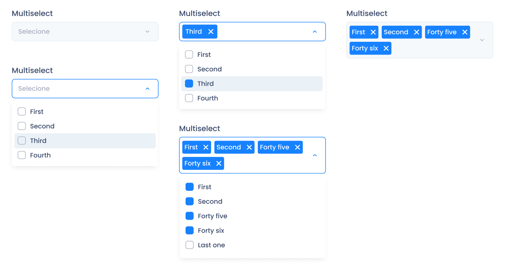

<h1 align="center">
    
     
     
    Desafio Técnico Front-end Jr. Cubos Academy
     
     
</h1>

### Objetivo

Implementar um componente de multiselect.

### Especificações

- O componente deverá ser construido utilizando React & Typescript
- Não poderá fazer uso de frameworks CSS, como Bootstrap e Foundation;
- Não poderá fazer uso de bibliotecas de componentes;
- Ser fiel ao design proposto (com as cores e espaçamentos corretos);
- Funcionar na última versão dos principais browsers.

### Especificações adicionais

As especificações a seguir **não são obrigatórias**, mas contam pontos **extras**:
- Utilizar storybook para exibir estados do componente.

### O multiselect deverá reproduzir o seguinte design:

> 

A fonte utilizada no componente é a **Poppins**.

## Entrega

O projeto do desafio técnico deve ser entregue no email **tecnologia.liderancas@cubos.academy** no seguinte formato:
- Repositório hospedado (Github, Gitlab, Bitbucket ou similares)

Deve existir um arquivo README.md no projeto com instruções para a compilação/execução da aplicação web.
